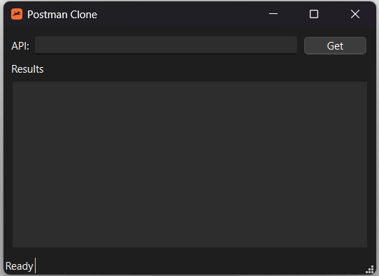
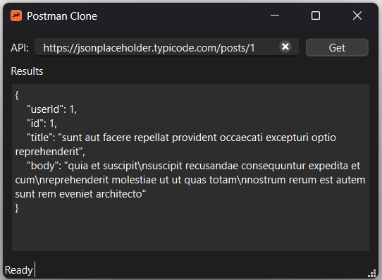

# Python-based Postman Clone
Postman Clone is a user-friendly interface that replicates the functionalities of Postman, enabling developers and testers to effortlessly perform GET requests to APIs, examine responses in neatly formatted JSON, and streamline API interaction, validation, and troubleshooting.

## Technologies Used
| Technology | Version |
|------------|---------|
| Python     | 3.11.5  |
| PyQt6      | 6.7.0   |
| requests   | 2.31.0  |
| validators | 0.28.1  |

## Using The App
1. Download the executable file from the release section.
2. When application launches, it should look like this:

3. Fill in your API URL and hit Get:

## Upcoming Changes
* POST, PUT, PATCH, and DELETE functionality
* Logging capabilities
* Export functionality to save results as JSON
